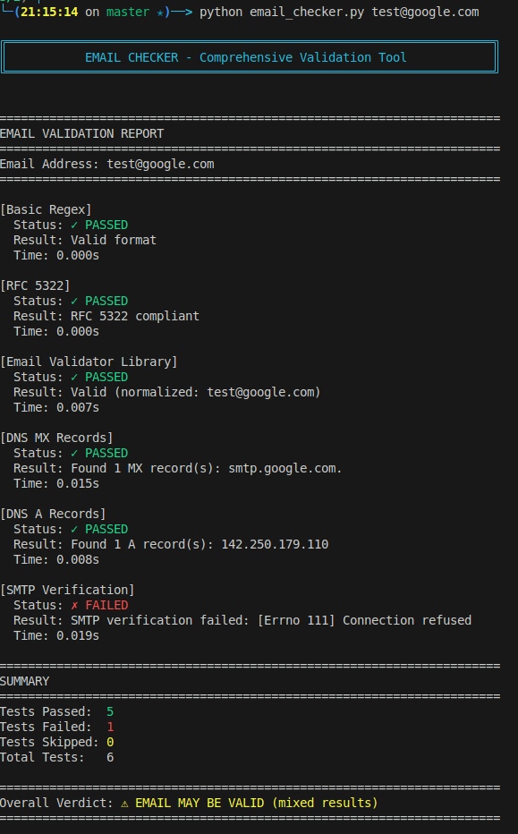

# Email Checker

## Installation

```bash
# Manage deps
virtualenv venv
source venv/bin/activate

# Install all dependencies
pip install -r requirements.txt
```


## USAGE

### Test your own email
```bash
python email_checker.py your.email@gmail.com
```

## Example
===




> :warning: **Most of the SMTP servers won't respond to the SMTP verification** (do not run this from an IP that can't afford to be blacklisted)